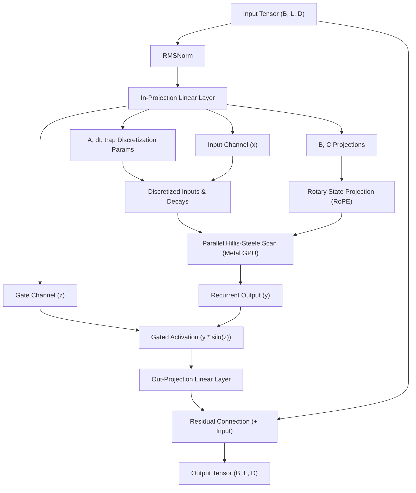

# Native MLX Mamba-3 on Apple Silicon

<p align="left">
  <a href="https://github.com/jada42/mlx-mamba3/actions/workflows/ci.yml">
    
  </a>
  <a href="https://github.com/ml-explore/mlx">
    
  </a>
  <a href="https://www.python.org/">
    
  </a>
  <a href="https://apple.com">
    
  </a>
  <a href="https://github.com/jada42/mlx-mamba3">
    
  </a>
  <a href="https://opensource.org/licenses/MIT">
    
  </a>
</p>

Native MLX reimplementation of the Mamba-3 architecture from `state-spaces/mamba`, adapted for Apple Silicon (MLX). The implementation mirrors the block-selection logic, core Mamba-3 recurrence concepts, inference-cache semantics, and config structure, while adding MLX-native generation, benchmarking, serialization, and LoRA fine-tuning utilities. It is executed locally with MLX on Apple Silicon, using Metal acceleration for benchmarked workloads.

---

### Verification & Status

* **✅ Numerical Parity:** Verified output correctness against the bundled PyTorch reference implementation in `ref_mamba3` (max error $< 10^{-5}$).
* **✅ Exponential-Trapezoidal Recurrence:** The previous `B*x` endpoint is transported through the exponential decay before trapezoidal blending in both SISO and MIMO paths.
* **✅ Cache Consistency:** Math-equivalent outputs between full prefill, chunked prefill, and token-by-token stateful decoding.
* **✅ Grouped B/C Projections:** `ngroups` supports any positive divisor of `nheads`, including intermediate group counts.
* **✅ LoRA SFT Support:** Mixed-precision training (`bfloat16`) with JIT-compiled stateful training loops.
* **✅ Supported Modes:** Full support for SISO, MIMO, and Hybrid Attention-Mamba configurations.
* **✅ Pure Native MLX:** Built directly on `mlx.core` and `mlx.nn` without external Linux or CUDA dependencies.

---

## Why This Repository?

Existing Mamba-3 implementations primarily target CUDA-based systems and require writing or compiling custom Triton or CUDA C++ kernels. This repository provides a native Python/MLX implementation optimized for Apple Silicon, making Mamba-3's architectural improvements (discretization, rotary states, and MIMO projections) accessible for local research, prototyping, and fine-tuning on macOS. 

*Note: This implementation represents an interpretation of the "Draft Specification of Mamba-3 Architectural Modifications" rather than a universally settled public standard, serving as a clean experimental reference.*

---

## Supported Features

- **✓ SISO Mode:** Single-input single-output channel-wise recurrent state tracking.
- **✓ MIMO Mode:** Multi-input multi-output matrix-projection recurrent mixing.
- **✓ Hybrid Blocks:** Alternating Mamba-3 and Causal Self-Attention blocks.
- **✓ Chunked Prefill:** Repeated cached forward calls preserve Mamba state, RoPE angle state, trapezoidal memory, and attention KV cache.
- **✓ Flexible B/C Grouping:** B/C projections are expanded from groups to heads for any `ngroups` that divides `nheads`.
- **✓ JIT Compilation:** Stateful training and inference compilation via `mx.compile`.
- **✓ Weights Serialization:** Remapping and saving weights to standard `.safetensors`.

---

## Mamba-3 Key Architectural Improvements

This package implements the three core innovations introduced in the Mamba-3 architecture:

1. **Exponential-Trapezoidal Discretization:**
   Replaces the traditional Euler discretization with a higher-order trapezoidal integration rule. This acts as an *implicit convolution* of the inputs, removing the need for a separate, heavy 1D convolution layer. The implementation applies the exponential transition to the previous endpoint before averaging with the current endpoint.
2. **Complex-Valued (Rotary) State Space:**
   Incorporates Rotary Position Embeddings (RoPE) into the state projection matrices, imposing a complex-valued phase rotation on the recurrence states. This enables tracking of complex oscillatory and phase dependencies.
   $$\theta_t = \theta_{t-1} + \Delta t \cdot \omega_t$$
3. **Multi-Input Multi-Output (MIMO) Formulation:**
   Reuses the hidden recurrent state across multiple rank-1 projections, converting the SISO outer products into full matrix multiplications to maximize GPU hardware compute density.

---

## Block Architecture

The Mamba-3 Block and its recurrence data flow are structured as follows:



---

## Benchmarks

The following benchmarks were measured locally on Apple Silicon:

### Hardware Setup
- **OS:** macOS
- **CPU/GPU:** Apple M1 Pro (10-core CPU, 16-core GPU)
- **Memory:** 16 GB unified RAM

### Execution Performance
*(Model: 4 Layers, `d_model=256`, `vocab_size=2000`, MIMO Mode with Rank-4)*

| Operation | Stage / Mode | Time / Throughput |
| :--- | :--- | :--- |
| **Prefill** (Length 128) | First Run (JIT Compile + Prefill) | **56.03 ms** |
| **Prefill** (Length 128) | Subsequent Runs (Compiled) | **8.02 ms** |
| **Decode** | Stateful Token Generation | **468.92 tok/s** |
| **LoRA SFT Step** | JIT Compiled Training Step | **~2.8 ms / step** |

---

## Repository Structure

```
joyful-lovelace/
  mlx_mamba_native/
    __init__.py          # Exposed APIs
    model.py             # Core Mamba-3 architecture
    cache.py             # MambaCache state container
    weights.py           # Weights loading/saving (safetensors)
    generate.py          # Autoregressive generation loop
    train.py             # LoRA wrapper and stateful compiled train step
  examples/
    generate.py          # Text generation & weights serialization example
    generate_hybrid.py   # Hybrid Transformer-Mamba-3 generation example
    finetune_tinystories.py  # Mixed-precision LoRA SFT demo on toy data
    benchmark.py         # Local performance benchmarking script
  ref_mamba3/
    README.md            # Reference notes and usage details
    research_notes.md    # Mamba-3 notes collected from the reference material
    mamba3.py            # PyTorch reference from the state-spaces source material
  tests/
    test_numerical.py    # Numerical comparison check against PyTorch
    test_step_eq_prefill.py  # Prefill vs. Step equivalence check
    test_hybrid.py       # Hybrid model equivalence check
    test_cache_chunking.py  # Chunked prefill and grouped B/C regression checks
```

---

## Getting Started

### Installation
Clone the repository and install the dependencies:
```bash
uv venv
source .venv/bin/activate
uv pip install mlx torch transformers safetensors numpy pytest einops
```

### Running Tests
Run the focused correctness suite to verify mathematical behavior:
```bash
.venv/bin/python -m pytest tests/test_numerical.py tests/test_step_eq_prefill.py tests/test_hybrid.py tests/test_cache_chunking.py -q
```

Expected result for the current focused suite:
```text
12 passed, 2 subtests passed
```

---

## Code Examples

### 1. Autoregressive Text Generation
```python
import mlx.core as mx
from mlx_mamba_native.model import MambaLMHeadModel, MambaConfig
from mlx_mamba_native.generate import generate

config = MambaConfig(d_model=128, n_layer=4, vocab_size=1000)
model = MambaLMHeadModel(config)

prompt = [10, 20, 30, 40]
output = generate(model, prompt, temp=0.0, max_tokens=10)
print("Generated token IDs:", output.tolist()[0])
```

### 2. Hybrid Transformer-Mamba-3 Model
```python
import mlx.core as mx
from mlx_mamba_native.model import MambaLMHeadModel, MambaConfig
from mlx_mamba_native.generate import generate

# Layers 0 & 2 are Mamba-3, Layers 1 & 3 are Self-Attention
config = MambaConfig(
    d_model=128,
    n_layer=4,
    vocab_size=1000,
    attn_layer_idx=[1, 3],
    attn_cfg={"num_heads": 4}
)
model = MambaLMHeadModel(config)

prompt = [10, 20, 30]
output = generate(model, prompt, temp=0.0, max_tokens=5)
print("Hybrid completions:", output.tolist()[0])
```

### 3. Mixed-Precision LoRA Fine-Tuning
```python
import mlx.core as mx
import mlx.optimizers as optim
from mlx_mamba_native.model import MambaLMHeadModel, MambaConfig
from mlx_mamba_native.train import convert_to_lora, make_train_step

model = MambaLMHeadModel(MambaConfig(d_model=64, n_layer=2, vocab_size=128))
convert_to_lora(model, r=4, alpha=8.0)

# Cast parameters to BF16 for mixed precision
flat_params = utils.tree_flatten(model.parameters())
cast_params = [(k, v.astype(mx.bfloat16)) for k, v in flat_params]
model.update(utils.tree_unflatten(cast_params))

optimizer = optim.Adam(learning_rate=1e-3)
train_step = make_train_step(model, optimizer)

# JIT-compiled training loop
for step in range(50):
    loss = train_step(inputs, targets)
    mx.eval(model.parameters(), optimizer.state)
```

---

## Future Work

- **Flash-style Scan Kernels**
- **Quantization:** Support for native 4-bit and 8-bit weight-only quantization (`mx.quantize`) for faster local inference. Eventually PolarQuant options for 3 and 4 bit

---

## References

- **Mamba:** Gu, A., & Dao, T. (2023). *Mamba: Linear-time sequence modeling with selective state spaces.* arXiv preprint arXiv:2312.00752.
- **Mamba-2:** Dao, T., & Gu, A. (2024). *Transformers are SSMs: Generalized alternative designs for selective state space models.* arXiv preprint arXiv:2405.21060.
- **Mamba-3:** Lahoti, A., Li, K. Y., Chen, B., Wang, C., Bick, A., Kolter, J. Z., Dao, T., & Gu, A. (2026). *Mamba-3: Improved sequence modeling using state space principles.* arXiv preprint arXiv:2603.15569.
- **State Spaces Reference:** `ref_mamba3` contains the local reference notes and `mamba3.py` reference material from the state-spaces source.
- **MLX:** Apple Machine Learning Research. (2023). *MLX: An array framework for Apple Silicon.* GitHub Repository.
